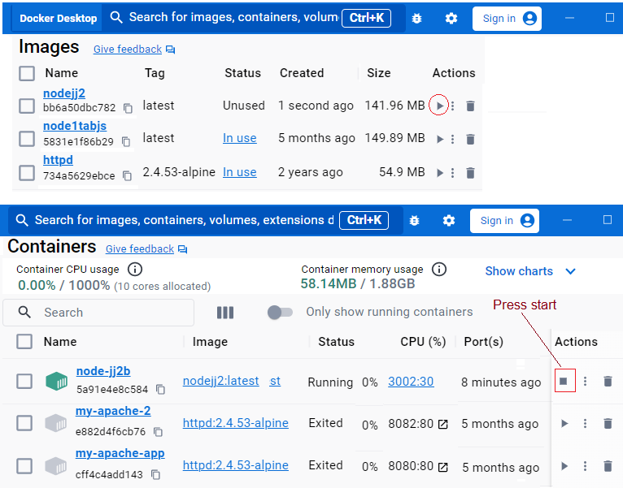
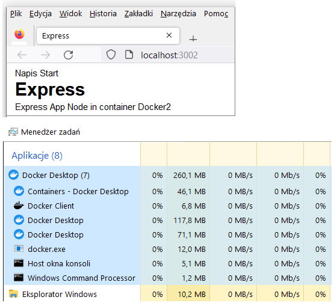

# Image configuration in Docker

Node web application with image configuration in Docker

## Description
The application presents sample settings and configurations for creating an application image in a Docker container. In addition to the application files, a light application environment necessary for its operation is also added to the container. This way, the container can be run on many different computers and the application will always work the same.
The main element of containerization is the Dockerfile.

.

.

